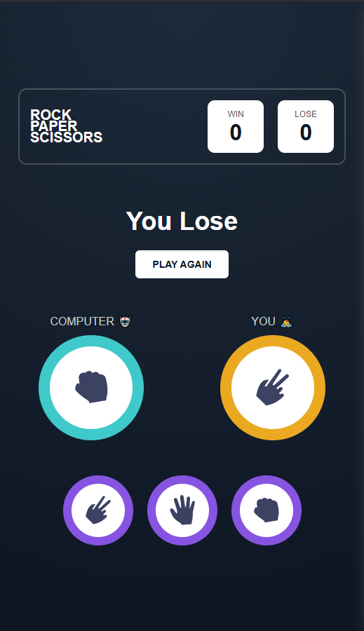

# Scissors Paper Rock Game 🎮

This is a simple interactive **Scissors–Paper–Rock** game built with HTML, CSS, and JavaScript. The player selects one of the options, and the computer (the "House") makes a random choice. The result is displayed with smooth animations and modern UI.

[ Live Demo 👈](https://shakhzodusmanov.github.io/SCISSORS-PAPER-ROCK-JS/)

## 📷 Previews

<p align="center">
  
  
</p>

## ✨ Features

- Smooth UI animations (pop-in effects)
- Interactive gameplay logic
- Responsive layout
- Modern and clean design

## 🛠 Technologies Used

- HTML5
- CSS3
- JavaScript (ES6)

## 📦 How to Run

1. Download or clone the repository:
   ```bash
   git clone https://github.com/shakhzodusmanov/SCISSORS-PAPER-ROCK-JS.git
   ```

2. Open the `index.html` file in your browser.


## 📁 File Structure

```
/SCISSORS-PAPER-ROCK-JS/
│
├── index.html
├── style.css
├── script.js
├── images/
│   ├── scissors-icon.svg
│   ├── paper-icon.svg
│   └── rock-icon.svg
├── README.md
└── LICENSE
```

## 📝 Reference & Credits

The visual style and idea were inspired by [markteekman's Rock Paper Scissors Game](https://github.com/markteekman/rock-paper-scissors-game).

## 📜 License

This project is licensed under the MIT License – see the [LICENSE](./LICENSE) file for details.
